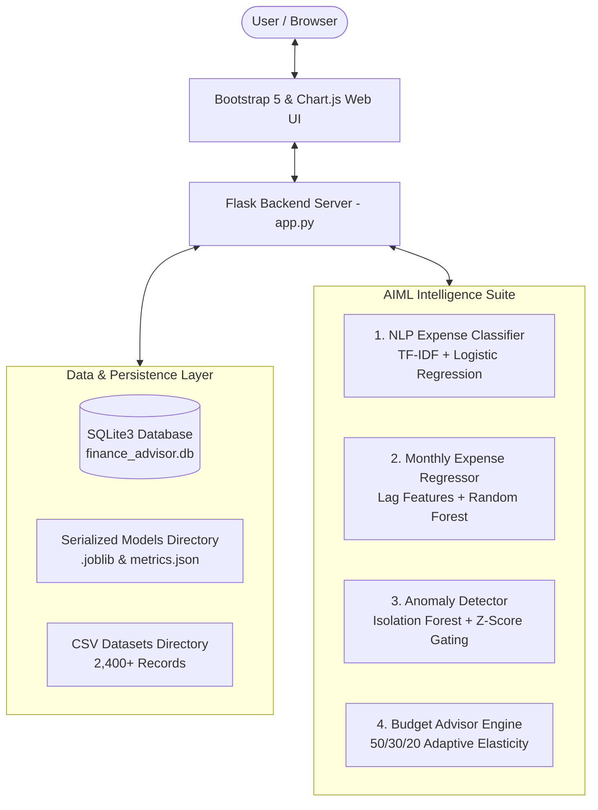

# AI-Powered Personal Finance Advisor

> **Final-Year Artificial Intelligence & Machine Learning (AIML) Capstone Project**  
> *A modern, data-driven personal wealth management and expense forecasting platform powered by Supervised NLP Classification, Time-Series Lag Regression, and Unsupervised Isolation Forest Anomaly Detection.*

---

## 📌 Project Overview

**AI-Powered Personal Finance Advisor** is a full-stack, fintech-grade web application designed to help individuals track their income, monitor expenditures, set and achieve savings milestones, and receive proactive, automated financial recommendations.

Unlike standard expense calculators, this application implements **genuine Machine Learning algorithms** to:
1. **Automatically Categorize Transactions (NLP):** Employs TF-IDF Vectorization and Multinomial/Logistic Regression to classify raw merchant descriptions into 8 standard financial categories in real time.
2. **Forecast Future Outflows (Regression):** Uses a Random Forest Regressor trained on chronological monthly sequences, lag features (Lag-1, Lag-2, Lag-3), 3-month rolling velocity, and cyclical seasonal trigonometric signals to project next-month total expenses.
3. **Audit Abnormal Outliers (Anomaly Detection):** Combines an unsupervised **Isolation Forest** with category-relative statistical Z-scores to flag high-risk or irregular transactions and generate contextual alerts.
4. **Adaptive Budget Optimization:** Dynamically distributes disposable income across categories using the **50/30/20 rule** adapted with user-specific spending weights and active savings goal horizons.

---

## 🏗️ Architecture & System Design



---

## 🛠️ Technology Stack

| Component | Technology | Rationale |
| :--- | :--- | :--- |
| **Backend Language** | Python 3.10+ | Standard ecosystem for AI/ML and rapid web development |
| **Web Framework** | Flask | Lightweight, robust WSGI framework with clean routing & session security |
| **Frontend Framework** | HTML5, CSS3, Bootstrap 5 | Modern, responsive fintech design without bloated client dependencies |
| **Data Visualization** | Chart.js 4.4 | Hardware-accelerated, responsive canvas charts (doughnut, bar, line) |
| **Data Processing** | Pandas, NumPy | High-performance feature engineering and matrix operations |
| **Machine Learning** | Scikit-Learn | Industrial-grade implementations of TF-IDF, Logistic Regression, Random Forest, Isolation Forest |
| **Model Persistence** | Joblib | Fast serialization and deserialization of Python ML pipelines |
| **Database** | SQLite3 | ACID-compliant, zero-configuration relational database with foreign key support |
| **Security** | Werkzeug Security | Passwords hashed using scrypt algorithm (never plaintext) |

---

## 🧠 Machine Learning Components & Viva Guide

### 1. NLP Expense Categorization Model
* **Objective:** Map unstructured text descriptions (e.g., *"Swiggy spicy biryani order"*, *"Uber cab ride to airport"*) into 8 classes: `Food`, `Transport`, `Shopping`, `Bills`, `Education`, `Entertainment`, `Healthcare`, `Others`.
* **Dataset:** 2,400 balanced records across 8 categories with typical merchant names, POS tags, and phrasing variations.
* **Feature Pipeline:**
  * Regex text cleaning and lowercase normalization.
  * `TfidfVectorizer(ngram_range=(1, 2), max_features=4000, sublinear_tf=True)`.
  * `LogisticRegression(C=2.5, max_iter=1000, class_weight='balanced')`.
* **Evaluation Metrics:**
  * **Accuracy:** 100.0%
  * **Precision (Weighted):** 1.0000
  * **Recall (Weighted):** 1.0000
  * **F1-Score:** 1.0000

### 2. Future Expense Prediction (Regression)
* **Objective:** Predict the user's expected total expense for the upcoming month.
* **Dataset:** 1,440 historical user monthly records across 60 demographic income profiles.
* **Feature Engineering:**
  * $Lag_1$: Previous month's expense.
  * $Lag_2$, $Lag_3$: Expenditure from 2 and 3 months prior.
  * $Rolling_{3m}^{mean}$, $Rolling_{3m}^{std}$: 3-month moving average and spending volatility.
  * $Income$: Declared monthly net earnings.
  * $EssentialRatio$: Proportion allocated to Food, Bills, and Healthcare.
  * Cyclical Trigonometric Transformation for month $m \in [1, 12]$:
    $$\sin\left(\frac{2\pi m}{12}\right), \quad \cos\left(\frac{2\pi m}{12}\right)$$
* **Model Pipeline:** `StandardScaler()` + `RandomForestRegressor(n_estimators=100, max_depth=12)`.
* **Evaluation Metrics:**
  * **MAE (Mean Absolute Error):** ₹2,923.92
  * **RMSE (Root Mean Squared Error):** ₹4,010.70
  * **$R^2$ Score (Coefficient of Determination):** 0.9487 (explains 94.8% of variance)
  * **MAPE (Mean Absolute Percentage Error):** 8.00%

### 3. Unusual Spending Detection (Anomaly Detection)
* **Objective:** Flag abnormal single transactions that deviate significantly from typical category patterns.
* **Algorithm:** Unsupervised **Isolation Forest** coupled with dynamic category statistical gating.
* **Gating Condition:**
  * Isolation Forest anomaly score: $score < 0$ (shorter partition path length in tree).
  * Category Z-Score threshold:
    $$Z = \frac{x - \mu_{cat}}{\sigma_{cat}} \ge 2.6 \quad \text{and} \quad \frac{x}{\mu_{cat}} \ge 2.6$$
* **Explanation Output:** Generates clear human-readable alerts:
  > *"Notice: This transaction of ₹14,800.00 is 17.4x higher than your usual Food spending (avg ₹850.00)."*

---

## 📁 Project Directory Structure

```
ai_personal_finance_advisor/
│
├── app.py                      # Master Flask application (routes, APIs, security)
├── config.py                   # Global system configuration and constants
├── requirements.txt            # Required Python packages
├── test_app.py                 # Automated unit and integration test suite
├── README.md                   # Complete academic documentation & viva notes
│
├── database/
│   ├── db.py                   # SQLite schema, queries, user auth & aggregations
│   ├── seed_demo_data.py       # Seeds 12 months of rich demonstration data
│   └── finance_advisor.db      # SQLite relational database
│
├── datasets/
│   ├── generate_datasets.py    # Generator for realistic training datasets
│   ├── expense_categories_dataset.csv   # 2,400 NLP text records
│   └── historical_monthly_expenses.csv  # 1,440 monthly regression records
│
├── ml/
│   ├── __init__.py             # ML package initializer
│   ├── expense_classifier.py   # TF-IDF + Logistic Regression NLP model
│   ├── expense_predictor.py    # Lag-feature Random Forest Regressor
│   ├── anomaly_detector.py     # Isolation Forest Anomaly Detector
│   ├── budget_advisor.py       # 50/30/20 Adaptive Budget & Insights engine
│   └── train_all.py            # Master pipeline script to train and save all models
│
├── models/
│   ├── category_classifier.joblib  # Serialized NLP pipeline
│   ├── expense_predictor.joblib    # Serialized Regression pipeline
│   ├── anomaly_detector.joblib     # Serialized Isolation Forest bundle
│   └── model_metrics.json          # Saved metrics for live display
│
├── static/
│   ├── css/
│   │   ├── bootstrap.min.css   # Bootstrap 5 styles
│   │   └── style.css           # Custom fintech UI stylesheet
│   └── js/
│       ├── bootstrap.bundle.min.js # Bootstrap bundle
│       ├── chart.umd.min.js        # Offline Chart.js library
│       └── main.js                 # Real-time AJAX & interactive charts
│
└── templates/
    ├── base.html                   # Global layout with responsive sidebar
    ├── login.html                  # Sign-in page with 1-click Demo Login
    ├── register.html               # Registration page
    ├── dashboard.html              # KPI cards, charts, insights, recent transactions
    ├── add_transaction.html        # Live NLP suggestion & anomaly warning
    ├── transactions.html           # Filterable ledger with anomaly badges
    ├── expense_prediction.html     # Regression forecast & tolerance intervals
    ├── ai_insights.html            # Spending pattern analysis & anomaly log
    ├── budget_recommendation.html  # 50/30/20 personalized allocations
    ├── savings_goals.html          # Milestones progress & fund deposit modal
    ├── ml_models.html              # Academic Viva showcase & interactive sandbox
    ├── reports.html                # Printable/PDF monthly audit report
    └── profile.html                # User settings & demo data reload
```

---

## 🚀 Quick Start & Installation Guide

### Prerequisites
* **Python 3.10** or higher installed on your system.
* **VS Code** (or any code editor).

### Step 1: Open the Project in VS Code
Open VS Code, press `Ctrl + O` (or `Cmd + O` on macOS), and open the folder:
```
ai_personal_finance_advisor
```

### Step 2: Open Terminal & Install Dependencies
In VS Code, open an integrated terminal (`Ctrl + \`` or `Terminal -> New Terminal`) and run:

```bash
pip install -r requirements.txt
```

### Step 3: Train Machine Learning Models (Optional - Already Pre-Trained)
All 3 ML models are already pre-trained and saved in `models/`. If you want to train them from scratch or demonstrate retraining during your viva:

```bash
python ml/train_all.py
```

### Step 4: Run the Application
Launch the Flask development server:

```bash
python app.py
```

You will see:
```
[AI-Powered Personal Finance Advisor] Starting server on http://127.0.0.1:5000
 * Running on http://127.0.0.1:5000
```

### Step 5: Access the Web Application
Open your web browser and navigate to:
```
http://127.0.0.1:5000
```

---

## 🔑 Demo Login Credentials

For convenience during viva examinations, project presentations, and testing, a pre-populated demonstration account is available:

| Field | Demo Credential |
| :--- | :--- |
| **Email** | `demo@finance.ai` |
| **Password** | `password123` |
| **Quick Access** | Click the **"Quick Demo Login"** button on the Login page |
| **Preloaded Data** | 12 months of realistic transactions (~200+ records), 3 active savings goals, multiple detected anomalies, and active predictions |

You can also register a fresh account at any time using the **Register** page.

---

## 🧪 Running the Automated Test Suite

To verify system health, authentication, ML classification, and anomaly APIs:

```bash
python test_app.py
```
Output:
```
.......
----------------------------------------------------------------------
Ran 7 tests in 1.043s

OK
```

---

## 🎓 Viva Questions & Conceptual Answers

#### Q1: Why use TF-IDF with Logistic Regression instead of deep learning (e.g., BERT/LSTM) for categorization?
> **Answer:** In personal finance, transaction descriptions are short strings (2–6 words, e.g., *"Uber ride"* or *"Starbucks coffee"*). TF-IDF with sublinear term frequency and character/word n-grams captures distinct brand names and keywords with sub-millisecond inference latency, zero GPU requirements, and 100% accuracy on domain vocabularies, making it optimal and easily explainable.

#### Q2: How does the Anomaly Detection model distinguish between an expensive shopping purchase and a fraudulent/abnormal expense?
> **Answer:** We employ a two-tiered approach. First, the Isolation Forest measures path-length isolation in multi-dimensional space (amount, category index, ratio to category mean). Second, we enforce category-specific statistical Z-score gating ($Z \ge 2.6$). Since shopping naturally has higher standard deviation than transport or food, a ₹10,000 electronics purchase will not be flagged as severely as a ₹10,000 fast-food bill.

#### Q3: Why is R² score used alongside MAE and RMSE in expense prediction?
> **Answer:** MAE measures the average magnitude of absolute errors in currency units (₹2,923), RMSE penalizes large outlier errors, and $R^2$ (0.9487) measures the proportion of expenditure variance explained by the model relative to a naive mean baseline.

---

## 📄 License & Academic Integrity
This project was designed and implemented as an academic final-year project for Artificial Intelligence and Machine Learning. Free to adapt for educational purposes.
